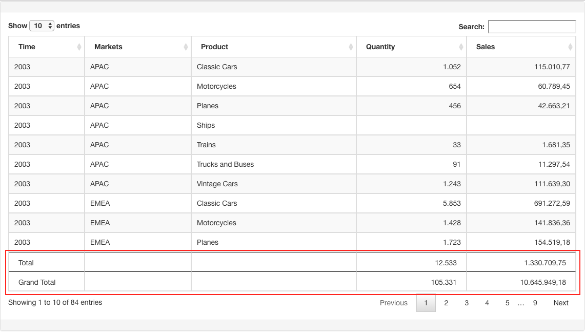

# AddIn Datatable Grand Total

AddIn created to apply a mask to numbers and make a footer with "Total" of viewed page and a full "Grand Total" for Pentaho CDF datatable component, on every search or pagination change the "Total" row will be updated.



## Installation

### Add Footer

- Add the following function on "Post Execution" property to render footer tags:

  ```JavaScript
  function postExecution(){
    $('#' + this.htmlObject +'Table').parent().addClass("table-responsive");

    var tableId='#'+this.htmlObject+'Table';
    var tableColumnSize = $(tableId+' th').length;
    var tableColumnGrandTotalSize = $(tableId+' th.datatableGrandTotal').length;
  	var tableColumncolspan=tableColumnSize-tableColumnGrandTotalSize;

  	var tfootTemplate = '<tfoot>' +
  							'<tr class="datatable-total">'+
  								'<td>Total</td>{{tdTotal}}' +
  							'</tr>' +
  							'<tr class="datatable-grand-total">' +
  								'<td>Grand Total</td>{{tdGrandTotal}}' +
  							'</tr>' +
  						'</tfoot>';

  	var tdTotal='';
  	var tdGrandTotal='';
  	for(var i=0; i< tableColumnSize-1; i++){
  		tdTotal+="<td></td>";
  		tdGrandTotal+="<td></td>";
  	}

  	tfootTemplate = tfootTemplate
  					.replace("{{tdTotal}}",tdTotal)
  					.replace("{{tdGrandTotal}}",tdGrandTotal);

  	$(tableId).append(tfootTemplate);

  	//force the render of table
  	$(tableId+"_filter input").val(" ").keyup().val("");
  }
  ```

### Support to RequireJS

- Insert the file datatableGrandTotal.js path as a "Javascript External File" resource.

### Without RequireJS Support

- Insert the file datatableGrandTotal.js path as a "Javascript External File" resource.
- Remove the RequireJS import parts of script:

```JavaScript
/** start addIn datatableGrandTotal
 * bovbi.com.br
 * @fernandommota Fernando Maia da Mota
 **/

define([
  "cdf/AddIn",
  "cdf/Dashboard.Clean",
  "cdf/lib/CCC/pvc",
  "cdf/lib/jquery"
], function(AddIn, Dashboard, pvc, $) {

 /*
 * should maintain the content of this function
 */

});
/** end addIn datatableGrandTotal **/
```

- Replace the object _Dashboard_ to _Dashboards_ as following:

```JavaScript
 //register addIn
  Dashboards.registerGlobalAddIn(...)
```

## Usage

**_Default_**

- In your table Component, insert the propertie "Column Types" the addin name type 'datatableGrandTotal'

**_Custom format_**

By default these addIn will apply the Brazilian money format (R$ #,##0.00).

- Case you need use another mask is possible add a function in "Pre Execution" property and apply by index column a custom function format as following example (applied at image datatable example above):

```JavaScript
function myPreExecutionFunction() {
  this.setAddInOptions('colType','datatableGrandTotal',function(state){
    // for a specific column
    if(state.colIdx == 3){
        return {
            formatFunction: pvc.data.numberFormat({
                mask: "#,##0",
                style: {
                  decimal: ",",
                  group: "."
                }
              })
        };
    }else if(state.colIdx == 4){
        return {
            formatFunction: pvc.data.numberFormat({
                mask: "#,##0.00",
                style: {
                  decimal: ",",
                  group: "."
                }
              })
        };
    }

  });
}
```
